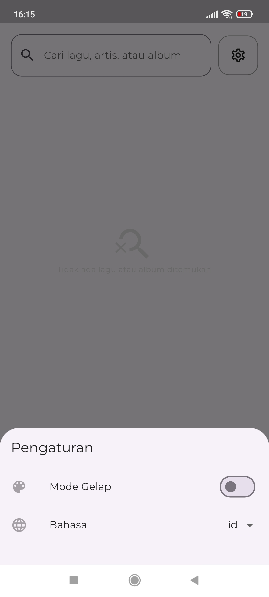
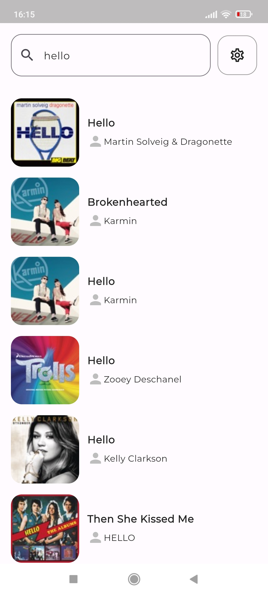
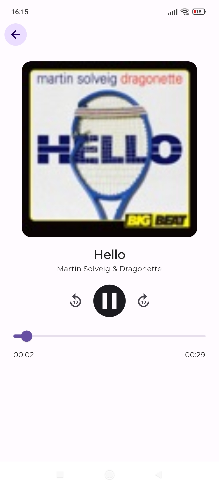
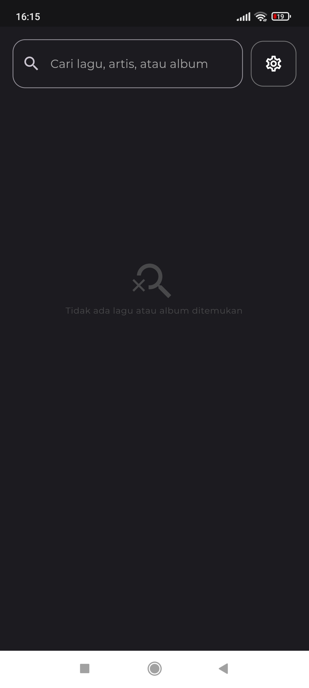
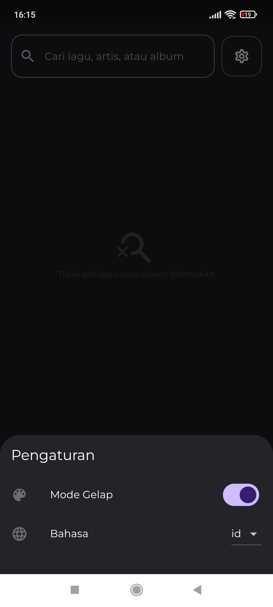
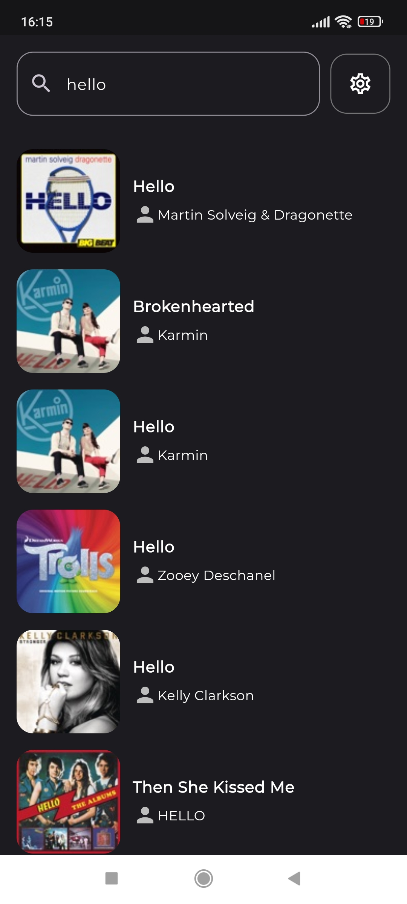
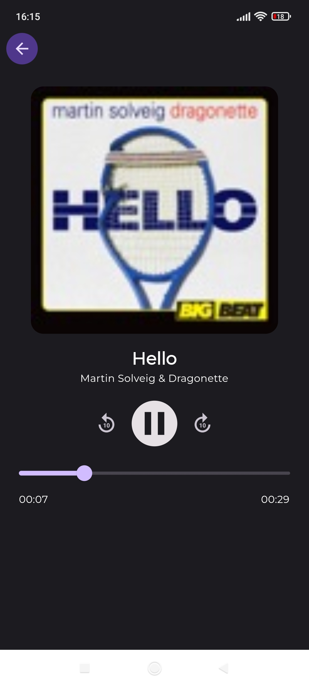

# iTunes Music Player
A simple music player app that uses iTunes API to search for songs, albums, artists and play them.

## Basic Setup
```bash
# generate localizations files
flutter gen-l10n

# run pub runner build_runner 
# - to generate injectable files
flutter packages pub run build_runner build --delete-conflicting-outputs  
```
## Features 
- [x] Search for songs, albums, artists
- [x] play/pause/seek/10s forward/10s backward
- [x] Dark mode
- [x] Localizations
- [x] Dependency injection

## Resources
### API
[iTunes API](https://developer.apple.com/library/archive/documentation/AudioVideo/Conceptual/iTuneSearchAPI/Searching.html)

### APK
[Download](resources/app-release.apk)

### Demo


### Light mode
<div style="display: grid; grid-template-columns: repeat(4, 1fr); grid-gap: 20px;">
  
  
  
  
</div>

### Dark mode
<div style="display: grid; grid-template-columns: repeat(4, 1fr); grid-gap: 20px;">
  
  
  
  
</div>


